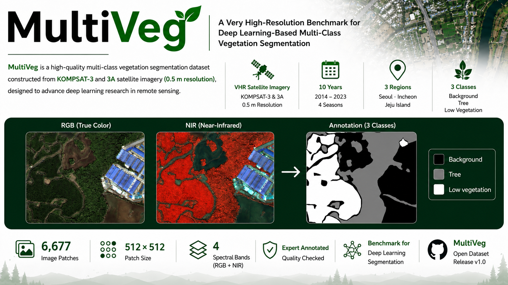
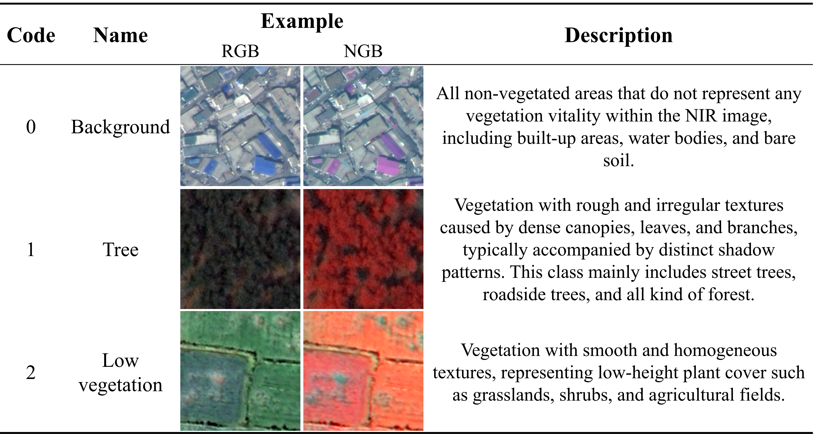
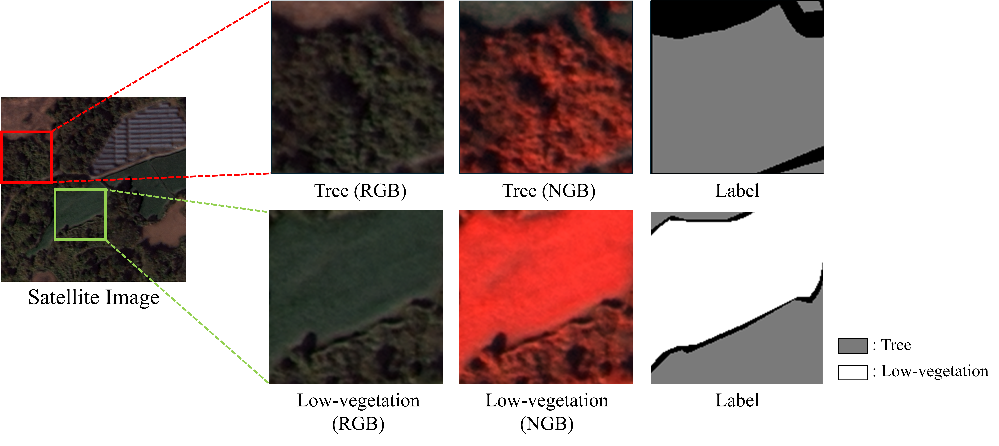
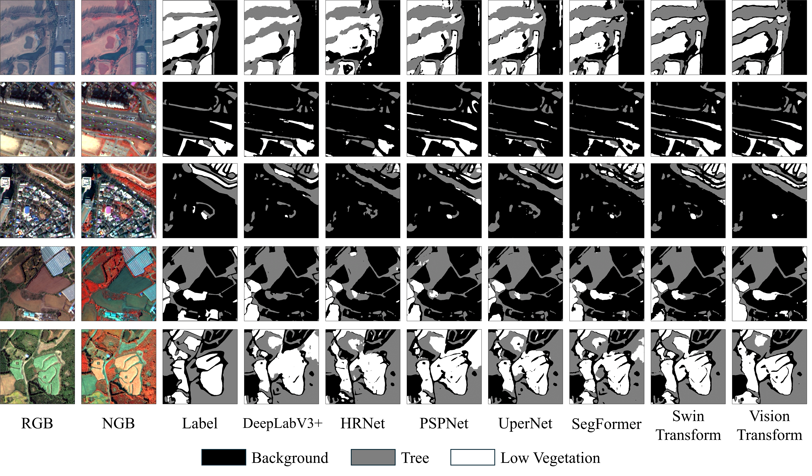

<div align="center">

# MultiVeg: A Very High-Resolution Benchmark for Deep Learning-Based Multi-Class Vegetation Segmentation


[](https://doi.org/10.3390/rs18010028)
[](#dataset-access)
[](https://sites.google.com/view/rsip/home)
<br>

[](#license)
[](https://creativecommons.org/licenses/by-nc/4.0/)
[](https://creativecommons.org/licenses/by/4.0/)

<br>

<!-- Representative image -->


**Figure 1.** Overview of the **MultiVeg** dataset. A very high-resolution satellite benchmark for **multi-class vegetation segmentation** using **RGB + NIR** imagery from **KOMPSAT-3 / KOMPSAT-3A**.

</div>

---

## If you find MultiVeg useful in your research, please consider giving this repository a star ⭐

This repository is the official release of **MultiVeg**, a very high-resolution benchmark dataset for deep learning-based multi-class vegetation segmentation.  
The associated paper can be accessed here: [Remote Sensing paper](https://doi.org/10.3390/rs18010028).

If you have any questions about the dataset, please feel free to open an issue or contact the repository maintainer:

- **Changhui Lee**  
- **Email**: ckdgml914@seoultech.ac.kr

We also welcome suggestions, academic discussions, and potential collaborations.

---

## Table of Contents

- [Updates](#updates)
- [Introduction](#introduction)
- [Highlights](#highlights)
- [Dataset Overview](#dataset-overview)
- [Class Definition](#class-definition)
- [Dataset Details](#dataset-details)
  - [Image Pre-processing](#image-pre-processing)
  - [Annotation and Quality Control](#annotation-and-quality-control)
- [Sample Visualization](#sample-visualization)
- [Benchmark Experiments](#benchmark-experiments)
- [Dataset Access](#dataset-access)
- [Repository Structure](#repository-structure)
- [Recommended Usage](#recommended-usage)
- [Citation](#citation)
- [License](#license)
---

## Updates

- **2026.04.19** — README reorganized with polished project layout, mixed-license clarification, updated dataset access, and visual documentation sections.
- **2025.12.22** — The MultiVeg paper was officially published in *Remote Sensing*. [Paper](https://doi.org/10.3390/rs18010028)
- **2025.12.17** — Repository initialized with placeholder README for upcoming MultiVeg dataset release.
- **2025.12.15** — The MultiVeg paper was accepted for publication in *Remote Sensing*.

> Future updates, including dataset revisions, additional benchmark results, and repository improvements, will be tracked in this section.

---

## Introduction

**MultiVeg** is a very high-resolution satellite benchmark dataset for **deep learning-based multi-class vegetation segmentation**.  
Unlike conventional binary vegetation mapping, MultiVeg explicitly separates **Tree** and **Low Vegetation** from **Background**, enabling finer-grained vegetation analysis for remote sensing, urban ecological monitoring, and environmental applications.

Built from **KOMPSAT-3 / KOMPSAT-3A** imagery, MultiVeg provides **RGB + NIR** bands at **0.5 m spatial resolution**.  
By incorporating NIR information, the dataset improves vegetation discrimination in challenging cases such as shadows, asphalt, and other spectrally confusing surfaces.

The official publication is available in *Remote Sensing*: [https://doi.org/10.3390/rs18010028](https://doi.org/10.3390/rs18010028).

---

## Highlights

- **Very high-resolution benchmark** based on satellite imagery at **0.5 m GSD**
- **Multi-class vegetation segmentation** with three semantic classes:
  - **Background**
  - **Tree**
  - **Low Vegetation**
- **RGB + NIR** multi-spectral imagery for improved vegetation discrimination
- **Expert-annotated dataset** with quality control and inter-annotator agreement analysis
- Benchmarking with representative **CNN-based** and **Transformer-based** segmentation models
- Diverse scenes collected across **Seoul, Incheon, and Jeju** from **2014 to 2023**

---

## Dataset Overview

| Item | Description |
|---|---|
| Dataset name | MultiVeg |
| Task | Multi-class vegetation segmentation |
| Satellite platform | KOMPSAT-3, KOMPSAT-3A |
| Spatial resolution | 0.5 m |
| Spectral bands | RGB + NIR |
| Acquisition period | 2014–2023 |
| Study regions | Seoul, Incheon, Jeju (Republic of Korea) |
| Patch size | 512 × 512 pixels |
| Number of patches | 6,677 |
| Number of classes | 3 |
| File format | PNG (8-bit) |

### Regional Distribution

| Region | Number of Patches | Ratio |
|---|---:|---:|
| Incheon | 2,859 | 42.8% |
| Jeju | 2,518 | 37.7% |
| Seoul | 1,300 | 19.5% |
| **Total** | **6,677** | **100.0%** |

---

## Class Definition

MultiVeg defines vegetation classes primarily based on **texture** and **spatial context** observed in very high-resolution satellite imagery.

| Class | Description |
|---|---|
| **Background** | Non-vegetated surfaces such as buildings, roads, bare land, water, and other non-vegetation objects |
| **Tree** | Vegetation with coarse and irregular texture, often associated with canopy structure and distinct shadow patterns |
| **Low Vegetation** | Grass, shrubs, cropland, and other relatively smooth and homogeneous vegetation surfaces |

> **Note**  
> Since satellite imagery does not directly provide absolute object height, the distinction between **Tree** and **Low Vegetation** is defined by image texture and contextual appearance rather than explicit height measurements.

### Class Legend

<p align="center">
  
</p>

<p align="center">
  <em>Figure 2. Class legend of MultiVeg: Background, Tree, and Low Vegetation.</em>
</p>

---

## Dataset Details

### Image Pre-processing

The MultiVeg dataset was prepared through the following procedure:

1. Collection of very high-resolution KOMPSAT-3 / KOMPSAT-3A satellite imagery  
2. Resolution harmonization to **0.5 m**  
3. Radiometric normalization using **linear stretching**  
4. Conversion to **8-bit PNG** format for efficient storage and model training  
5. Patch extraction into **512 × 512** tiles  
6. Quality screening to remove unusable or ambiguous samples  

### Annotation and Quality Control

- All labels were generated by experts in remote sensing image interpretation.
- Each pixel was annotated as **Background**, **Tree**, or **Low Vegetation**.
- Ambiguous cases were reviewed through expert discussion and cross-checking.
- Annotation consistency was assessed using **Fleiss’s Kappa**.
- The reported inter-annotator agreement indicates substantial consistency (**Fleiss’s Kappa = 0.6172**).
- Patches severely affected by cloud cover, extreme shadow obstruction, blur, or radiometric distortion were excluded from the final dataset.

---

## Sample Visualization

<p align="center">
  
</p>

<p align="center">
  <em>Figure 3. Representative examples from MultiVeg. Each example may include an RGB or RGB+NIR composite image and its corresponding pixel-wise annotation mask.</em>
</p>

---

## Benchmark Experiments

MultiVeg was benchmarked using representative deep learning-based semantic segmentation models, including both CNN-based and Transformer-based architectures.  
All models were trained and evaluated under the same experimental settings using **4-band RGB + NIR imagery**.

#### Overall Performance

| Model | OA | mIoU | mF1 | mPrecision | mRecall | Pretrained Weights |
|---|---:|---:|---:|---:|---:|---|
| DeepLabV3+ | 89.52 | 70.28 | 80.79 | 85.87 | 78.11 | [Download .pth](GOOGLE_DRIVE_LINK_DEEPLABV3PLUS) |
| HRNet | 90.45 | 74.34 | 84.27 | 84.74 | 83.86 | [Download .pth](GOOGLE_DRIVE_LINK_HRNET) |
| PSPNet | 91.05 | 75.91 | 85.44 | 85.22 | 85.67 | [Download .pth](GOOGLE_DRIVE_LINK_PSPNET) |
| UPerNet | 90.94 | 75.12 | 84.83 | 86.56 | 83.54 | [Download .pth](GOOGLE_DRIVE_LINK_UPERNET) |
| ConvNeXt | <u>92.31</u> | <u>78.81</u> | <u>87.56</u> | <u>88.25</u> | <u>86.70</u> | [Download .pth](GOOGLE_DRIVE_LINK_CONVNEXT) |
| SegFormer | 91.82 | 77.70 | 86.76 | 87.53 | 86.05 | [Download .pth](GOOGLE_DRIVE_LINK_SEGFORMER) |
| **Swin Transformer** | **92.33** | **78.88** | **87.58** | **88.40** | **86.83** | [Download .pth](GOOGLE_DRIVE_LINK_SWIN_TRANSFORMER) |
| Vision Transformer (ViT) | 92.00 | 77.93 | 87.49 | 88.21 | 85.86 | [Download .pth](GOOGLE_DRIVE_LINK_VIT) |
| MIFNet | 91.29 | 75.74 | 85.27 | 86.80 | 84.06 | [Download .pth](GOOGLE_DRIVE_LINK_MIFNET) |

#### Class-wise Performance

| Model | Background IoU | Tree IoU | Low Vegetation IoU | Background F1 | Tree F1 | Low Vegetation F1 |
|---|---:|---:|---:|---:|---:|---:|
| DeepLabV3+ | 88.77 | 83.79 | 56.17 | 94.05 | 91.18 | 71.94 |
| HRNet | 88.12 | 82.74 | 52.18 | 93.68 | 90.55 | 68.57 |
| PSPNet | 89.02 | 83.56 | 55.16 | 94.19 | 91.05 | 71.10 |
| UPerNet | 88.54 | 83.50 | 53.32 | 93.92 | 91.01 | 69.55 |
| ConvNeXt | <u>90.13</u> | <u>85.44</u> | <u>60.32</u> | 94.64 | <u>92.21</u> | <u>75.50</u> |
| SegFormer | 89.63 | 84.69 | 57.77 | 94.53 | 91.71 | 74.03 |
| **Swin Transformer** | **90.20** | **85.65** | **60.78** | **94.85** | **92.27** | **75.65** |
| Vision Transformer (ViT) | 89.90 | 84.88 | 59.01 | <u>94.68</u> | 91.82 | 74.22 |
| MIFNet | 89.62 | 83.26 | 54.34 | 94.52 | 90.87 | 70.42 |

> The best and second-best results for each evaluation metric are highlighted in **bold** and <u>underlined</u>, respectively.

### Key Observations

- **Swin Transformer** achieved the best overall performance across all evaluation metrics.
- **ConvNeXt** showed the second-best overall performance and was the strongest CNN-based model.
- **Background** and **Tree** classes were segmented more reliably than **Low Vegetation**.
- **Low Vegetation** remained the most challenging class due to class imbalance and spectral ambiguity in complex urban scenes.
- The use of **RGB + NIR** imagery provides useful spectral information for distinguishing vegetation from confusing non-vegetated surfaces.

<p align="center">
  
</p>

<p align="center">
  <em>Figure 4. Visual comparison of representative semantic segmentation models on the MultiVeg dataset.</em>
</p>
---

## Dataset Access

The MultiVeg dataset is available through the following channel:

- **Google Drive**: [MultiVeg Download Link](https://drive.google.com/drive/folders/1ndN-dxFy9cBSA7QTyY4haAu4QAlJaUfo?usp=drive_link)

> **Split policy**  
> MultiVeg is provided as a unified collection of image patches.  
> Users may define their own **train / validation / test** split depending on their research protocol.

---

## Repository Structure

```text
MultiVeg/
├── README.md
├── DATA_LICENSE.md
├── LICENSES/
│   ├── CC-BY-4.0.txt
│   └── CC-BY-NC-4.0.txt
├── assets/
│   ├── multiveg_banner.png
│   ├── multiveg_samples.png
│   ├── class_legend.png
│   └── benchmark_results.png

```

---
## Recommended Usage
MultiVeg can be used for:
 - Multi-class vegetaetion segmentation (Specific)
 - Urban green space monitoring
 - Ecological and environmental remote sensing
 - RGB vs RGB+NIR comparative experiments
 - Benchmarking semantic segmentation models on very high-resolution imagery

---

## Citation
If you use **MultiVeg** in your research, please cite the associated paper:
```text
@article{lee2026multiveg,
  title={MultiVeg: A Very High-Resolution Benchmark for Deep Learning-Based Multi-Class Vegetation Segmentation},
  author={Lee, Changhui and Han, Youkyung and Lee, Jinmin and Kim, Taeheon and Lee, Hyunjin and Javed, Aisha and Chung, Minkyung},
  journal={Remote Sensing},
  volume={18},
  number={1},
  pages={28},
  year={2026},
  doi={10.3390/rs18010028},
  url={https://www.mdpi.com/2072-4292/18/1/28}
}
```
paper links:
- DOI: https://doi.org/10.3390/rs18010028
- Publisher page: https://www.mdpi.com/2072-4292/18/1/28
---

## License

MultiVeg uses **mixed data licenses**:

- `images/`: **CC BY-NC 4.0**
- `masks/`: **CC BY 4.0**

For full details, please see [DATA_LICENSE.md](./DATA_LICENSE.md).

